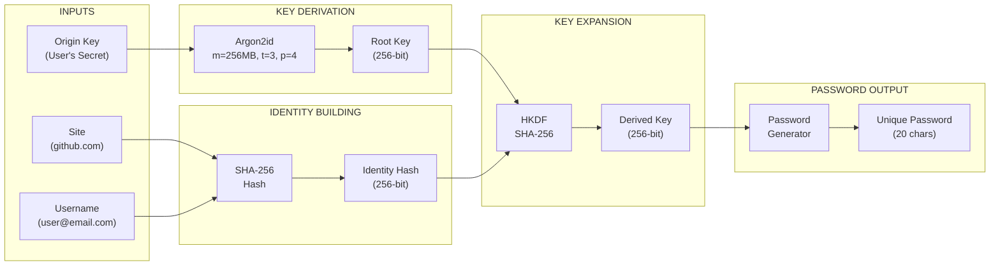

# Zero Origin

> ONE ORIGIN KEY. INFINITE CREDENTIALS.

Zero Origin is a deterministic password generator that creates unique passwords for every site/account combination using a single master key. No password storage required — passwords are generated on-demand using cryptographic primitives.

## Overview

Zero Origin implements the principle of **deterministic password generation**:

```
Origin Key + Site + Username → Unique Password
```

Given the same inputs, Zero Origin always produces the same password. This means:
- **No password database** — never worry about data breaches
- **No sync** — works offline, works anywhere
- **One secret to remember** — your Origin Key

## How It Works

### Cryptographic Pipeline



### Security Details

| Component | Algorithm | Parameters |
|-----------|-----------|------------|
| Key Derivation | Argon2id | mem=256MB, time=3, parallelism=4 |
| Identity Hash | SHA-256 | 256-bit output |
| Key Expansion | HKDF | SHA-256, no salt |
| Password Format | Custom | a-z, A-Z, 0-9, !@#$%^&*()-_=+ |

### Data Privacy

- **Zero Knowledge**: Origin Key never leaves your browser
- **No Server Storage**: No passwords stored anywhere
- **Client-Side Only**: All cryptographic operations happen in-browser
- **Session-Based**: Origin Key stored in sessionStorage (cleared on tab close)

### Site Normalization

Sites are automatically normalized before hashing:
- Stripped of protocol (`https://`, `http://`)
- Stripped of `www.` prefix
- Stripped of path (`/dashboard` → `example.com`)
- Lowercased

## Tech Stack

| Category | Technology |
|----------|------------|
| Framework | Next.js 16.2.12 |
| Language | TypeScript 5 |
| UI | React 19, Tailwind CSS 4 |
| Components | shadcn/ui, Radix UI |
| Cryptography | argon2-browser, Web Crypto API |
| Icons | Lucide React |
| Testing | Vitest |

## Project Structure

```
zero_origin_app/
├── public/
│   └── argon2/              # Bundled Argon2 WASM
├── src/
│   ├── app/
│   │   ├── api/
│   │   │   └── verify-pin/  # PIN verification endpoint
│   │   ├── generator/       # Password generator page
│   │   ├── pin/             # PIN entry page
│   │   ├── setup/           # Origin Key setup page
│   │   ├── layout.tsx       # Root layout
│   │   └── page.tsx         # Home page
│   ├── components/          # UI components
│   ├── hooks/
│   │   ├── use-clipboard.ts
│   │   └── use-session-storage.ts
│   ├── lib/
│   │   └── crypto/
│   │       ├── argon2.ts    # Argon2id key derivation
│   │       ├── engine.ts    # Main password generation logic
│   │       ├── formatter.ts # Password formatting
│   │       ├── hkdf.ts      # HKDF key expansion
│   │       ├── sha256.ts    # Identity hashing
│   │       └── index.ts     # Public API
│   └── types/               # TypeScript definitions
├── .env.local               # Environment variables
├── package.json
└── README.md
```

## Getting Started

### Prerequisites

- Node.js 18+
- npm 9+

### Installation

```bash
# Clone the repository
git clone <repository-url>
cd zero_origin_app

# Install dependencies
npm install

# Copy environment template
copy .env.local.example .env.local
```

### Environment Variables

Create `.env.local` with the following:

```env
# Optional: PIN protection (recommended for production)
# Generate PIN hash: echo -n "YOUR_PIN" | sha256sum
PIN_HASH=
```

### Development

```bash
# Start development server
npm run dev

# Open http://localhost:3000
```

### Production Build

```bash
# Build for production
npm run build

# Start production server
npm start
```

### Testing

```bash
# Run tests
npm test

# Run with coverage
npm test -- --coverage
```

## Usage Flow

### 1. First Time Setup

1. Visit the application
2. Click "Create Origin Key"
3. Enter a strong Origin Key (minimum 8 characters)
4. Confirm the Origin Key
5. Read and acknowledge the warning — **Origin Key cannot be recovered**

### 2. Generate Passwords

1. Click "Go to Generator" or navigate to `/generator`
2. Enter the site (e.g., `github.com`)
3. Enter your username/email
4. Click "Generate Password"
5. Copy the generated password

### 3. PIN Protection (Optional)

Set `PIN_HASH` in environment variables to add an extra layer of protection:
- Rate limiting: 3 attempts before lockout
- Exponential backoff: 30s → 60s → 120s → ...

## Security Considerations

### Strengths

- **No Password Storage**: Eliminates password database breach risk
- **Argon2id**: Memory-hard KDF resistant to GPU/ASIC attacks
- **Deterministic**: Same inputs = same output (verifiable)
- **Client-Side**: No secret transmission over network

### Limitations

- **Origin Key Loss**: Cannot recover passwords without the Origin Key
- **No Password History**: Cannot retrieve previous passwords for the same site
- **Session Storage**: Origin Key cleared on tab/browser close (by design)
- **Physical Security**: Origin Key is in memory while session is active

### Recommendations

1. Use a strong Origin Key (16+ characters, mix of types)
2. Enable PIN protection in production
3. Use different usernames per site when possible
4. Clear session after use on shared devices

## API Reference

### POST /api/verify-pin

Verify PIN for session authentication.

**Request:**
```json
{
  "pin": "123456"
}
```

**Response (Success):**
```json
{
  "success": true
}
```

**Response (Error):**
```json
{
  "error": "Invalid PIN"
}
```

**Response (Rate Limited):**
```json
{
  "error": "Too many attempts",
  "retryAfter": 30
}
```

## License

MIT
